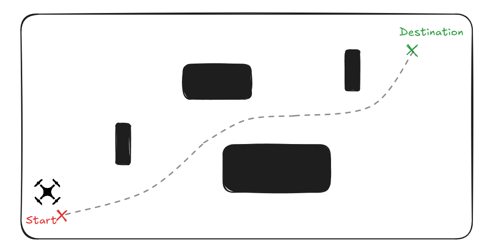
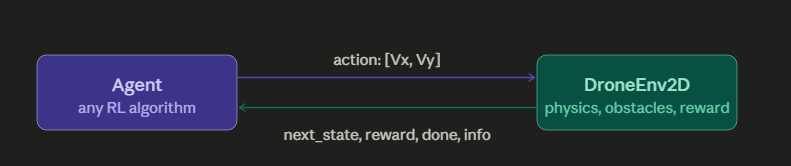

<!-- Experimenting repository to implement almost all RL-Algorithms from calssic one (Q-Learning/SARSA) to the latest one (PPO / Actor-Critic ).
Algorithms are used to guide a drone that moves in 2D space, from point S to destination S, while trying to avoid obstacles, by giving velocity commands : Vx and Vy.

# Environement & Agent:

The RL frameork is used in two main reasons : when we don't have serialized dataset, or when we don't have a required loss-function to modelize such desire (like the case for human preference in desired LLM responses, hence the use of RLHF techniques to align with the model ).
in this framwork, data is required through some interaction between our system that we want to train, named the **Agent**, that performs some actions in a **Environement**, and based on the actions the env either rewards him positively or negatively.

For our case, we want to train a drone policy to navigate in an environemnt without crashing, and to attend a desired destination in the fastest way possible.

- The drone is commanded by Velocity vector : (Vx,Vy). the drone scenario tells that there is a gravity field in y-axis, meaning if no command $V_y=0$ the drone will just fall and crash.

# RL-Vocabulary (under this example) :

- policy : the policy Function is the function that gives you wich action to take given a stat $\pi(a|s)$. the aim of RL algorithms is to find the best policy $\pi^*(a|s)$, that will give us the shortest and safest path in our example here.

- Reward : The reawrd is the key wining for RL, can be seen as the loss-function, and must be wisely chosen deoending of the scenario, for our drone example :
  - _progress_ : to encourage moving closer to Destination. if deosn't exist, the algo will find hard timeto know where to start.
    computed as (dist_prev - dist_now) \* scale. the scale controlls how effective this reward is : if null, the drone will wander not knowing from wich direction start moving, if too high, the drone won't consider to maybe go back to find maybe a shorter path. set to +1
  - _time penalty_ : this is a negative reward, pushing the algo to arrive faster so he donsn't loose much from this penalty. set to -1
  - _collision penalty_ : another negative reawrd, but high in magnitude, since we definetly never want to do a collision. set to -10
  - _goal_bonus_ : this gives a huge bonus when destination is reached. focusing that the the big objective is to arrive to D. set to +100
  - final reward function : r = progress - time_penalty - collision_penality + goal_bonus.
    to tune the values on your preference, visit : "env/reward.py"

- Value function

- Horizon -->

# RL101

**RL101** is an experimentation repository for implementing and understanding Reinforcement Learning algorithms — from classical methods (**Q-Learning**, **SARSA**) to modern approaches (**Actor-Critic**, **PPO**).

The goal is to train a **2D drone navigation policy** that moves from a start position **S** to a destination **D** while avoiding obstacles.

The drone is controlled through Acceleration commands $ (a_x, a_y) $

---

# Environment & Agent

Reinforcement Learning (RL) is useful when:

- No labeled/serialized dataset is available
- The desired behavior cannot be expressed through a standard loss function

In RL, an **Agent** interacts with an **Environment**:

- The **Agent** performs actions
- The **Environment** returns rewards or penalties
- The Agent learns a policy that maximizes long-term reward

In this project, the objective is to train the **command system** of a **drone** in order to :

- Reaches the destination safely
- Avoids obstacles
- Minimizes travel time

> what happens in each step : At time $t=0,1,2.... N$. the agent in **state** $s_t$ takes **action** $a_t$ and receives **reward** $r_t$, then moves to **state** $s_{t+1}$.

### Drone Dynamics

The drone receives velocity commands: $(\mathcal{a}_x, \mathcal{a}_y)$

The environment simulates **gravity along the y-axis**.  
If: $\mathcal{a}_y = 0$. the drone naturally falls and eventually crashes.

### Covered Topics :

- **Classic RL** : dynamic_programming / Q-learning / TD-learning / Monte-Carlo.
  - these algorithms run on a finite set of state and actions, a discretiation of the drone environement is required and done with the script : `env/discrete_wrapper.py`
- **Deep RL** (coming)
- **Policy Gradient** (coming)

---

# RL Vocabulary (Using Drone Scenario)

### I. Policy

A **policy** determines which action $a$ to take given a state $s$, modeled by the function $\pi(a|s)$
RL aims to find the **optimal policy**: $\pi^*(a|s)$ that produces the safest and shortest trajectory.

In general, this function is stochastic, meaning it gives a distribution over the set of all actions \matchal{A}, when the drone is at state $s_t = s$ : $\pi(a|s) = \mathbb{P}(a_t = a| s_t = s) $

---

### II. Reward Function

The reward function defines the desired behavior.

For this drone task:

| Reward Component      | Purpose                              |  Value |
| --------------------- | ------------------------------------ | -----: |
| **Progress Reward**   | Encourages moving toward destination |   `+1` |
| **Time Penalty**      | Encourages faster arrival            |   `-1` |
| **Collision Penalty** | Strongly discourages crashes         |  `-10` |
| **Goal Bonus**        | Reward for reaching destination      | `+100` |

Final reward:

\[
r = progress - timePenalty - collisionPenalty + goalBonus
\]

_Reward tuning can be modified in_: `env/reward.py`

---

### III. Gain : Objective function

Given the rewards $r_0, r_1, r_2...$, the **Gain** is refered as $G = r_0 + \gamma*r1 + \gamma^2*r_2 + ....$

the parameter $\gamma \in [0,1] $ is the discount factor.

In the RL realm, this is the **Objective Function** that every policy tires to **maximize**, this allows to introduce sence of comparaison between policies : $\pi_1 > \pi_2 \Leftrightarrow \mathbb{E}_{\pi_1}(G) > \mathbb{E}_{\pi_2}(G) $

> _Note_
>
> - I remind that usually a policy is stochastic, meaning that for many episodes using the same policy, we can get multiple sequences of states, each with his own Gain. We report then the Mean of the Gains, hence the Expectation symbol.
> - This is one drawback of RL-Algorithms, that they are _Ustable_, or more mathematicallly they suffer from high Variance. in this scope, Reaserchers In papers report the Gain of a policy coming with its variance : G = $\mu \pm \sigma $. that is usually reported in papers and research tries to combat, to give the reader a better understading, giving him the choice of the trad-off : Less Gain but Stable/ More Gain but unstable, depending on his use-case.

---

### III. Value Function

The **value function** of a _policy_ estimates the expected future Gain from a state $s$ : $V_\pi(s) = \mathbb{E}(G|s_0 = s) $
It helps the agent evaluate whether a state is promising or dangerous.

> _Notes_ :
>
> - I used the Expectation since the policy is not deterministic (or the environement that gives the reswards). in the latter case, the expectation is removed

---

### IV. Horizon

The **horizon** defines how far into the future the agent considers rewards.

- **Short horizon** → greedy behavior
- **Long horizon** → better long-term planning
